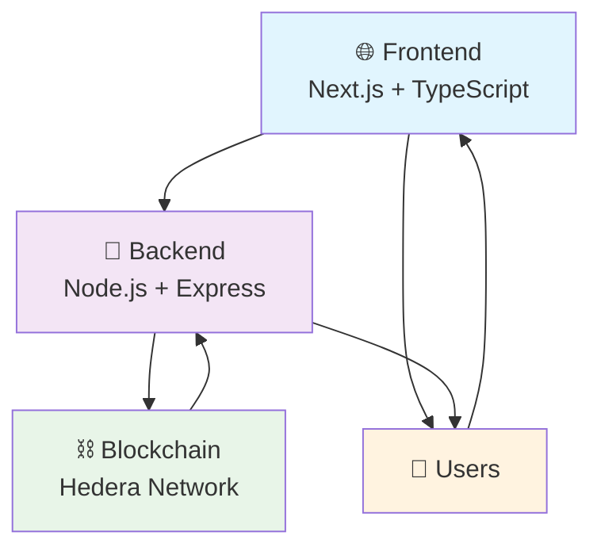

# 🚀 Hedera CommunEA

<div align="center">


[](https://dorahacks.io/hackathon/hederahackafrica)
[](LICENSE)
[](CONTRIBUTING.md)

*Gamified Community Governance for Sustainable Hedera Growth in East Africa*

[📖 Documentation](docs/README.md) • [🎯 Live Demo](https://hedera-communea.vercel.app) • [🎪 Hackathon Submission](https://dorahacks.io/hackathon/hederahackafrica)

</div>

---

## ✨ Overview

Hedera CommunEA is a revolutionary **Decentralized Autonomous Cooperative (DACO)** platform designed for the **Hedera Africa Hackathon 2025**. We focus on **Sub-track 4: Immersive Experience**, creating engaging meme coins, reward systems, and community-owned economies to foster decentralized control and sustainable growth of the Hedera ecosystem in East Africa.

### 🎯 Mission
Transform community participation through gamification, enabling East African users to actively shape the Hedera network's future while building economic opportunities and digital sovereignty.

### 🏆 Hackathon Context
- **Event**: Hedera Africa Hackathon 2025
- **Track**: Immersive Experience (Sub-track 4)
- **Prize Pool**: $1,000,000+
- **Submission Deadline**: October 31, 2025
- **Beta Launch**: October 30, 2025

---

## 🏗️ Architecture



### 📁 Project Structure

```
HederaCommunEA/
├── 🎨 frontend/                 # Next.js 16 React app (TypeScript + Material-UI v7)
│   ├── src/
│   │   ├── app/                 # Next.js App Router
│   │   │   ├── globals.css      # Global styles with Tailwind
│   │   │   ├── layout.tsx       # Root layout with Material-UI ThemeProvider
│   │   │   └── page.tsx         # Landing page with M3 components
│   │   ├── components/          # React components
│   │   │   ├── *-M3.tsx         # Material Design 3 variants
│   │   │   └── WalletConnect.tsx # Wallet integration
│   │   ├── contexts/            # React contexts
│   │   │   └── WalletContext.tsx # Wallet state management
│   │   ├── hooks/               # Custom React hooks
│   │   └── theme/               # Material Design 3 theme system
│   │       ├── materialDesign3.ts # Comprehensive M3 theme
│   │       ├── ThemeProvider.tsx # Theme context provider
│   │       └── index.ts         # Theme exports
│   ├── package.json             # Frontend dependencies
│   └── next.config.ts           # Next.js configuration
├── ⚙️ backend/                  # Node.js Express API (Hedera SDK)
│   ├── server.js                # Express server with HTS integration
│   └── package.json             # Backend dependencies
├── ⛓️ blockchain/               # Future smart contracts
├── 📚 docs/                     # Comprehensive documentation
└── 🛠️ tools/                    # Development utilities
```

---

## 🌟 Key Features

### 🎮 DACO Governance
- **Democratic Control**: One-member-one-vote system
- **Cooperative Ownership**: Community-driven decision making
- **Legal Framework**: Company limited by guarantee in Kenya

### 🪙 Meme Coin Factory
- **HTS-Powered**: Fast, cost-effective token creation
- **Customizable**: Name, symbol, supply, and metadata
- **Trading Platform**: Built-in marketplace for community tokens

### 🎁 Reward Systems
- **Gamified Incentives**: Points, badges, and achievements
- **Community Contributions**: Rewards for participation and engagement
- **NFT Governance**: Voting rights through non-fungible tokens

### 🌍 East Africa Focus
- **Localized UI**: Swahili language support
- **Regional Communities**: Tanzania, Kenya, and expanding
- **Cultural Integration**: Traditional cooperative principles

---

## 🚀 Quick Start

### 📋 Prerequisites
- **Node.js** v20+ ([Download](https://nodejs.org/))
- **Git** ([Download](https://git-scm.com/))
- **Hedera Testnet Account** ([Portal](https://portal.hedera.com/))

### ⚡ Installation

1. **Clone the repository**
   ```bash
   git clone https://github.com/your-org/hedera-communea.git
   cd hedera-communea
   ```

2. **Setup Frontend**
   ```bash
   cd frontend
   npm install
   npm run dev
   ```
   🌐 Frontend will be available at [http://localhost:3000](http://localhost:3000)

3. **Setup Backend**
   ```bash
   cd ../backend
   npm install
   # Create .env file with Hedera credentials
   cp .env.example .env
   node server.js
   ```
   🔧 Backend API will run on [http://localhost:3001](http://localhost:3001)

4. **Environment Configuration**
   ```env
   # Hedera Testnet
   HEDERA_ACCOUNT_ID=your_account_id
   HEDERA_PRIVATE_KEY=your_private_key

   # App Config
   NEXT_PUBLIC_API_URL=http://localhost:3001
   NODE_ENV=development
   ```

### 🧪 Testing
```bash
# Frontend tests
cd frontend && npm test

# Backend tests
cd ../backend && npm test

# End-to-end tests
npm run test:e2e
```

---

## 🎪 Beta Release

### 📅 Timeline
- **Launch Date**: October 30, 2025
- **Duration**: 24 hours initial beta
- **Platform**: Hedera Testnet

### 🎯 Beta Features
- ✅ **Material Design 3 UI**: Complete M3 theme system with Hedera branding
- ✅ **Modern Landing Page**: Sleek, one-page design with Eastern Africa focus
- ✅ **HTS Token Creation**: Full meme coin creation platform with wallet signing
- ✅ **Production Backend**: Node.js/Express with Hedera SDK v2.75.0 integration
- ✅ **Responsive Design**: Mobile-first with glassmorphism effects
- ✅ **Security**: CORS, validation, and production middleware
- ✅ **Testing Ready**: Comprehensive beta testing guides prepared

### 📊 Success Metrics
- User registrations and engagement
- Token creation and trading volume
- Community feedback and participation

---

## 📚 Documentation

<div align="center">

| Document | Description | Link |
|----------|-------------|------|
| 📋 **Project Overview** | Complete project description | [docs/README.md](docs/README.md) |
| 🛠️ **Technical Specs** | Architecture and implementation | [docs/technical-spec.md](docs/technical-spec.md) |
| 🚀 **Beta Release Plan** | Launch strategy and roadmap | [docs/beta-release-plan.md](docs/beta-release-plan.md) |
| 👥 **Community Strategy** | Growth and engagement plans | [docs/community.md](docs/community.md) |
| ⚙️ **Development Setup** | Local environment guide | [docs/development-setup.md](docs/development-setup.md) |
| 🏛️ **DACO Model** | Governance framework details | [docs/daco-model.md](docs/daco-model.md) |

</div>

---

## 🤝 Contributing

We welcome contributions from the community! 🎉

### How to Contribute
1. Fork the repository
2. Create a feature branch (`git checkout -b feature/amazing-feature`)
3. Commit your changes (`git commit -m 'Add amazing feature'`)
4. Push to the branch (`git push origin feature/amazing-feature`)
5. Open a Pull Request

### Development Guidelines
- Follow the [Contributing Guide](CONTRIBUTING.md)
- Write tests for new features
- Update documentation as needed
- Ensure code follows TypeScript best practices

### Community
- 💬 [Discord Server](https://discord.gg/hedera-communea)
- 🐛 [Issue Tracker](https://github.com/your-org/hedera-communea/issues)
- 📧 [Email Support](mailto:team@hederacommunea.org)

---

## 🏆 Hackathon Progress

### 📈 Current Status
- ✅ **Ideation**: Complete - DACO model defined
- ✅ **Research**: Complete - Hedera HTS integration implemented
- ✅ **Development**: Complete - Beta release production ready
- 🔄 **Deployment**: Ready - Vercel + Render configurations prepared
- ⏳ **Submission**: October 31, 2025 (awaiting final deployment)

### 🎖️ Achievements
- 🏅 **Modern UI/UX**: Complete landing page with Eastern Africa focus
- 🏅 **HTS Integration**: Production-ready token creation API
- 🏅 **Documentation**: Comprehensive deployment and testing guides
- 🏅 **Architecture**: Scalable Next.js + Node.js implementation
- 🏅 **Beta Ready**: 90% complete, awaiting final deployment

---

## 👥 Team

<div align="center">

| Role | Name | Contact |
|------|------|---------|
| 🎯 **Project Lead** | [Your Name] | [@twitter](https://twitter.com/) |
| 💻 **Frontend Dev** | [Team Member] | [@github](https://github.com/) |
| ⚙️ **Backend Dev** | [Team Member] | [@linkedin](https://linkedin.com/) |
| ⛓️ **Blockchain Dev** | [Team Member] | [@discord](https://discord.gg/) |

*Join our team for the Hedera Africa Hackathon 2025!*

</div>

---

## 📄 License

This project is licensed under the **MIT License** - see the [LICENSE](LICENSE) file for details.

---

## 🙏 Acknowledgments

- **Hedera Hashgraph** for the revolutionary distributed ledger technology
- **Exponential Science Foundation** for organizing the Africa Hackathon
- **East African Developer Community** for inspiration and support
- **Open Source Community** for the amazing tools and frameworks

---

<div align="center">

**Made with ❤️ for the Hedera Community in East Africa**

[🌟 Star us on GitHub](https://github.com/your-org/hedera-communea) • [📧 Contact Us](mailto:hello@hederacommunea.org) • [🌐 Website](https://hederacommunea.org)

*Building the future of decentralized governance, one community at a time.*

</div></content>
<parameter name="filePath">E:\Polymath Universata\Projects\HederaCommunEA\README.md